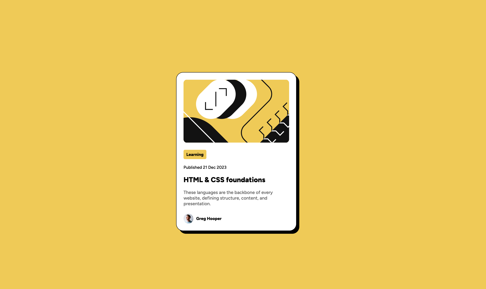
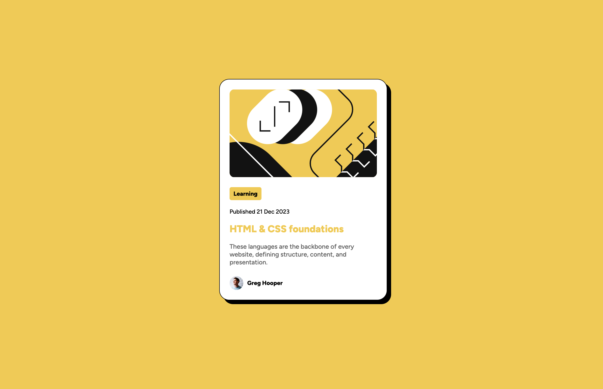
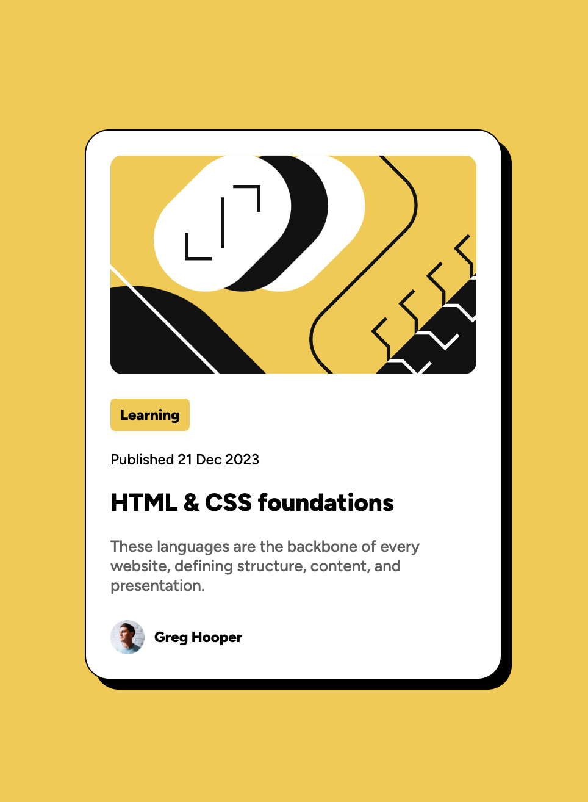

# Frontend Mentor - Blog preview card solution

This is a solution to the [Blog preview card challenge on Frontend Mentor](https://www.frontendmentor.io/challenges/blog-preview-card-ckPaj01IcS). Frontend Mentor challenges help you improve your coding skills by building realistic projects.

## Table of contents

- [Overview](#overview)
  - [The challenge](#the-challenge)
  - [Screenshot](#screenshot)
  - [Links](#links)
- [My process](#my-process)
  - [Built with](#built-with)
  - [What I learned](#what-i-learned)
  - [Useful resources](#useful-resources)

**Note: Delete this note and update the table of contents based on what sections you keep.**

## Overview

### The challenge

Users should be able to:

- See hover and focus states for all interactive elements on the page

### Screenshot

### Links

- Solution URL: [Add solution URL here](https://your-solution-url.com)
- Live Site URL: [Add live site URL here](https://your-live-site-url.com)

## My process

### Built with

- Semantic HTML5 markup
- CSS
- Flexbox

### What I learned

- A major takeaway for me was the use of fit-content on the card text elements which ensured the elements only took the width they needed & did not grow to take the full row in flexbox.

### Useful resources

The following resources helped me get a better understanding of flexbox in general.

- [https://flexbox.malven.co/](https://flexbox.malven.co/)
- [https://css-tricks.com/snippets/css/a-guide-to-flexbox/#aa-flexbox-tricks](https://css-tricks.com/snippets/css/a-guide-to-flexbox/#aa-flexbox-tricks)
